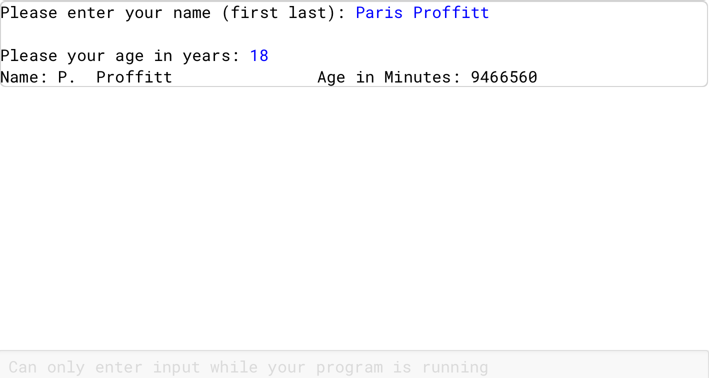

# Age in Minutes Calculator

## Description
This project is part of my AP Computer Science A coursework.  
It is a Java program that uses user input to perform arithmetic calculations and parsing. It outputs the first initial, last name, and age in minutes of the user. 

## Features
- Prompts the user to enter their full name and age in years.
- Converts the user's age in years to an approximate age in minutes.
- Formats the user's name to display the first initial and last name.
- Displays the formatted name along with the calculated age in minutes.

## How to Run
1. Open the project in **BlueJ**.
2. Compile all classes.
3. Run the main class (`AgeCalculatorV1`).
4. Enter your full name and age in years when prompted.
5. The program will display your formatted name and approximate age in minutes.

## Notes
- This project was completed using **BlueJ**.
- All source code is written in **Java**.

## Sample Output
Here’s a preview of the AgeCalculator program in action:

